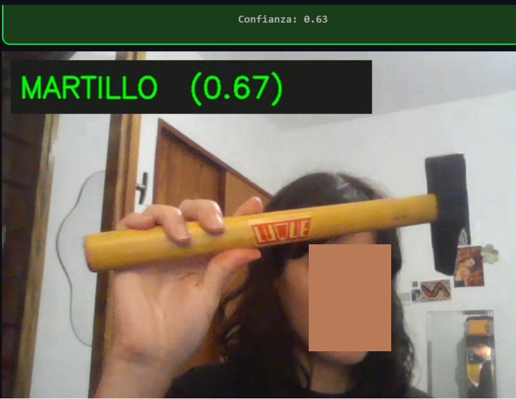

## [ES] Demo Interactiva con Streamlit

Como prueba de concepto de inferencia en tiempo real, se desarrolló una aplicación web utilizando **Streamlit** y **streamlit-webrtc**, que permite clasificar herramientas directamente desde la cámara del dispositivo.

#### > 🔗 **[Descargar modelo_herramientas.h5](https://github.com/AgusDelga2/industrial-tool-classifier-cnn/releases/tag/v2.0)**

### Stack técnico de la demo

| Componente | Tecnología |
|---|---|
| Interfaz web | Streamlit |
| Captura de video en tiempo real | streamlit-webrtc + WebRTC |
| Procesador de frames | `VideoProcessorBase` + `av.VideoFrame` |
| Actualización de UI | streamlit-autorefresh (intervalo: 800ms) |

La inferencia corre en un hilo separado (`async_processing=True`) de forma thread-safe mediante `threading.Lock`. El preprocesamiento aplicado a cada frame es consistente con el pipeline de entrenamiento: conversión a escala de grises y redimensionado a **150×150 píxeles**.

### Umbrales de clasificación

Se evaluaron distintas combinaciones de umbrales. Los valores que mostraron el mejor equilibrio entre sensibilidad y precisión fueron:

| Clase | Umbral |
|---|---|
| 🔨 Martillo | Confianza ≥ **0.60** |
| 🪛 Destornillador | Confianza ≤ **0.40** |
| ❓ Zona de desconfianza | Entre 0.40 y 0.60 |

### Limitaciones observadas en la demo

- El modelo tiende a clasificar fondos neutros o caras como **Martillo**, lo que refleja el sesgo de la clase presente en el dataset de entrenamiento (Recall Martillo: 0.70 vs. Recall Destornillador: 0.75).
- La clasificación mejora notablemente cuando la herramienta **ocupa el centro del encuadre** y hay buena iluminación.
- Con umbrales más permisivos (ej. 0.55/0.45) se reduce la zona de desconfianza pero aumentan los falsos positivos.
- La demo requiere conexión estable para la negociación WebRTC (STUN server: `stun.l.google.com`).

> 

---

### Trabajo Futuro

Además de las mejoras de modelo mencionadas, se considera como mejora futura la incorporación de un **umbral de confianza mínimo global** previo a la clasificación binaria, que permita al modelo abstenerse de clasificar cuando ninguna clase supera un nivel de certeza aceptable. Esta lógica de "rechazo de muestra" ayudaría a reducir los falsos positivos en condiciones reales de uso, y será evaluada en iteraciones futuras junto con la expansión del dataset y Transfer Learning.

---

## [EN] Interactive Demo with Streamlit

As a proof of concept for real-time inference, a web application was developed using **Streamlit** and **streamlit-webrtc**, enabling tool classification directly from the device's camera.

#### > 🔗 **[Download modelo_herramientas.h5](https://github.com/AgusDelga2/industrial-tool-classifier-cnn/releases/tag/v2.0)**

### Demo Tech Stack

| Component | Technology |
|---|---|
| Web interface | Streamlit |
| Real-time video capture | streamlit-webrtc + WebRTC |
| Frame processor | `VideoProcessorBase` + `av.VideoFrame` |
| UI refresh | streamlit-autorefresh (interval: 800ms) |

Inference runs on a separate thread (`async_processing=True`) in a thread-safe manner using `threading.Lock`. The preprocessing applied to each frame is consistent with the training pipeline: grayscale conversion and resizing to **150×150 pixels**.

### Classification Thresholds

Several threshold combinations were tested. The values that showed the best balance between sensitivity and precision were:

| Class | Threshold |
|---|---|
| 🔨 Hammer | Confidence ≥ **0.60** |
| 🪛 Screwdriver | Confidence ≤ **0.40** |
| ❓ Uncertainty zone | Between 0.40 and 0.60 |

### Limitations Observed in the Demo

- The model tends to classify neutral backgrounds or faces as **Hammer**, reflecting the class bias present in the training dataset (Hammer Recall: 0.70 vs. Screwdriver Recall: 0.75).
- Classification improves significantly when the tool **occupies the center of the frame** and lighting conditions are adequate.
- More permissive thresholds (e.g., 0.55/0.45) reduce the uncertainty zone but increase false positives.
- The demo requires a stable connection for WebRTC negotiation (STUN server: `stun.l.google.com`).

> 

---

### Future Work

In addition to the model improvements mentioned above, a future enhancement under consideration is the incorporation of a **global minimum confidence threshold** prior to binary classification. This would allow the model to abstain from classifying when neither class surpasses an acceptable certainty level. This "sample rejection" logic would help reduce false positives in real-world usage conditions, and will be evaluated in future iterations alongside dataset expansion and Transfer Learning.
